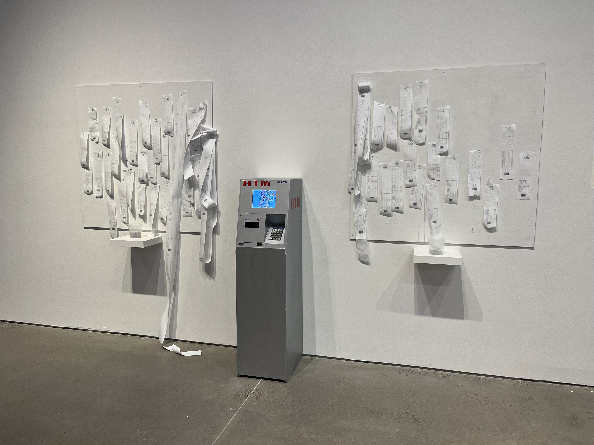

# Parcel ATM



_Parcel ATM_ is an art project and website conceived for [Data through Design 2024](https://datathroughdesign.com/). The installation will allow visitors to query [22 years of NYC MapPLUTO data](https://www.nyc.gov/site/planning/data-maps/open-data/bytes-archive.page). This repo contains the source code for the ATM's interface.

Under the hood, the ATM interface is just a website running in chromium in kiosk mode, a feature that allows the browser to run in full-screen mode, hiding the address bar and other browser controls.

## Running the ATM

### Turning it on

1. Pull the ATM a few inches from the wall so you can access its internals.
1. Plug cords back if unplugged.
1. Turn on the raspberry pi (it may do so automatically when you plug it in; if not, press the on button on the side). A green light on raspberry pi should be illuminated, going from flashing green to solid green. After the raspberry pi is on, the following should be true: screen is illuminated and showing a desktop; the numpad keyboard should be faintly illuminated behind the keys; printer is on (see that the solid blue light on top is illuminated).
1. Open the terminal app.
1. Remove the full keyboard and mouse from the back of the ATM. I like to place them on the top of the ATM. Turn on the keyboard and mouse as necessary.
1. Open the terminal app by clicking the `>\_` icon in the menu bar at top.
1. Run `./Documents/github/pluto-hist/startup.sh`. You should now see some logging in the terminal before a window is launched in full-screen / kiosk mode.

> [!NOTE]
> This command needs to be from `/home/fishmulch`, the default directory location for this computer. If the command fails and errors saying it can’t find the script, run `cd /home/fishmulch` and try again

8. Place the cursor in the middle of the black pin on the map. I like to put it over the white dot. IMPORTANT: If you don’t do this the map will not zoom or it will not zoom intuitively to the middle, but to the cursor’s location.
1. Turn off the keyboard and mouse, placing them back inside the ATM.
1. Push the ATM back up against the wall, centering it on the grout line on the floor.

#### Check that it is working

Try:

- Panning the map with arrow keys
- Zooming with rotary encoder
- Printing a receipt
- Turning on different layers with the other keys

### Maintenance

#### General

- First, try refreshing the interface by **pressing** the rotary encoder - (secret! It’s also a key).
- Make sure the plugs are still plugged in. Did they get bumped and come unplugged?
- There is a popup/alert on the screen
  - Get the trackpad out of the back of the ATM and click cancel. Then, try refreshing the page by pressing the rotary encoder.
  - If that didn’t work, try a full restart
- Is the wifi connected?

##### Restarting the ATM interface

Exit the interface in order to try a full reload

- Pull ATM from the wall
- Take out the keyboard and mouse. Turn them on with the switches in the - back.
- `Alt` + `Cnrl` + `T` to open a terminal window.
- Run `pkill chromium`
- Run `./Documents/github/pluto-hist/startup.sh` again
- Make sure to replace the cursor in the center of the map marker, turn off the trackpad and keyboard, place them in the back of the ATM, and push the ATM against the wall.

#### Printing

Replacing the paper

1. Go get the door key and a fresh roll from the closet
1. Open the door (agin, key in blue-lidded container in closet)
1. Open the printer door with the grey latch.
1. Remove the empty roll.
1. Place the fresh roll into the machine with the feeding side of the paper **up**.
1. Pull the feeder side of the paper out and close the door, making sure the roll stays well coiled.
1. Check that it is working.

Is the printer on and connected to the raspberry pi?

1. Open the door with the key
1. Check that the printer is on (a blue light should be illuminated)
1. Check that the paper is full (the lights on the front should indicate this but you can also open it up)
1. Check that the grey cord is properly connected to the back of the printer and is plugged into the raspberry pi

Paper is not feeding properly

1. Open the door (you'll need the key)
1. Press the small circular button and see if the paper feeds out. If so, great, it’s probably cleared. It’s unlikely this works if you’re here.
1. Open the printer door with the grey latch. The paper is probably loosely coiled. Remove the roll and tighten the paper around the roll.
1. Place roll back into the machine with the feeding side of the paper **up**. There is a diagram inside the door.
1. Pull the feeder side of the paper out and close the door, making sure the roll stays well coiled.
1. Check that the printer is working.

For anything else, refer to the [printer manual](https://download4.epson.biz/sec_pubs/bs/pdf/TM-T20III_trg_en_revE.pdf).

#### Screen isn’t turning on

- Make sure that the screen is turned on. It should be on by default when the power is on but there is a tiny “POWER” button on the thin mini-PCB board with buttons connected to the screen driver PCB board.
- Try switching the HDMI port the screen is connected to on the Raspberry Pi. There are two next to each other on the side of the Raspberry PI.
- Check that the screen driver PCB board is connected to the screen, via the Flexible Flat Cable (FFC).

##### Reconnecting the FFC

To reconnect the FFC to the screen driver PCB:

1. Open the port by pushing the small grey FFC latches out, on either side of the FFC port on the screen driver.
1. Insert the FFC into the port. If it doesn’t insert easily, make sure the latches are open.
1. Close the FFC latches. You should hear an audible click as they snap shut.

### Shut down

1. Pull the ATM away from the wall
1. Grab the keyboard and mouse from the back, turning them back on.
1. Stop the app: `Alt` + `Cnrl` + `T` to open a terminal window; run `pkill chromium`
1. Shutdown the raspberry pi by pressing the green light button.
1. Click Shutdown from the menu shown on the screen.
1. Turn off the printer.

## Developer set-up

This project includes four components:

1. [Backend](./backend/README.md)
1. [Frontend](./pluto-hist/README.md)
1. [ELT](./elt/README.md)
1. [EDA](./eda/README.md)

Component-specific set-up instructions for each component are included in the `README.md` files linked above.

### General set-up

#### Python: Backend, ELT, EDA

This project uses the [poetry](https://python-poetry.org/docs/) dependency manager tool for the backend, ELT, and EDA components. Make sure you have poetry installed. GDAL and GEOS are dependencies of this project.

The frontend is a VanillaJS app using Vite. Follow their [installation guide](https://vitejs.dev/guide/) to get started.

#### Environment Variables

Create a `.env` file in the root directory with:

```
DEV=true
```
